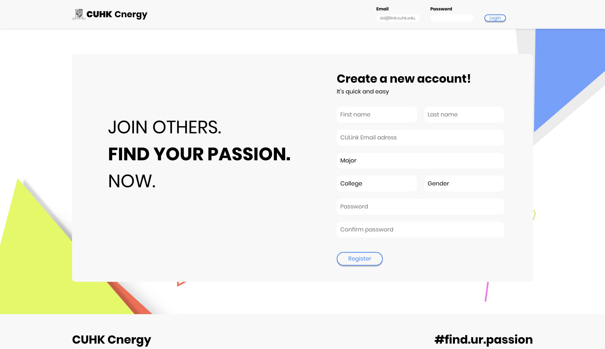
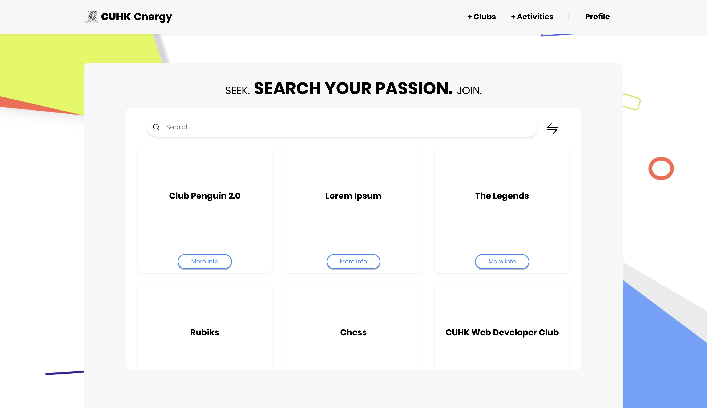
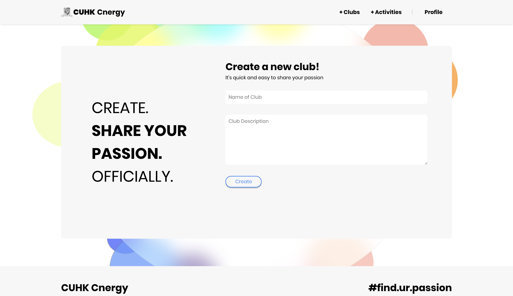
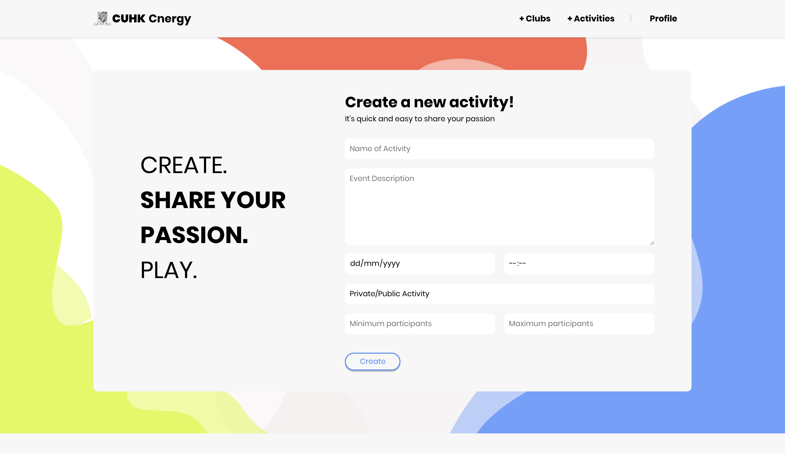

# CSCI3100 Group 16
CSCI3100 Software Engineering 

A group project that revolves around creating a centralised Club Web Application for CUHK, where students can easily discover and join
their desired club. 

The application is built using VueJS. 

NodeJS, npm and MySQL are assumed to be already installed on your system

On MySQL, we will instruct how to install on Linux and macOS systems:
### macOS
```
brew update
brew install mysql
```

### Linux
```
sudo apt-get update,
sudo apt-get install mysql-server 
```

I'm also assuming you have already git cloned the project, and have already changed directory in your terminal to it.
## For Frontend
Assuming you don't already have VueJS in the system, 
### Installing VueJS
```
npm install -g vue
```

### Installing the Vue CLI (needs this too)
```
npm install -g @vue/cli
```

### To check if installation was successful
```
vue --version
```

Some dependencies are required:

```
npm install -g typescript
```

```
npm install -g axios
```

```
npm install -g mysql
```

```
npm i vue-simple-alert
```

### Vuetify
```
vue add vuetify
```

### Element-UI:
```
npm i element-ui -S
```

## For Backend
Change your directory to /server then:

```
npm install
```

### Configure the .env (or create it)
Create the file .env in the root of the /server/ folder and insert this into the file:
```
JWT_SECRET=someTextCanBeAnything
```
### Setting up the database
```
mysql -u root -p

// or mysql, as long as you can get to the mysql terminal shell
// database configuration can be checked in /server/ormconfig.json
// feel free to configure as you like, but remember to create the database first

CREATE DATABASE database_name_in_ormconfig;
USE database_name_in_ormconfig;
```

And you're set! 

Just exit that terminal, open two new ones under the /server directory:
First run:
```
sudo npm run ts
```
...then:
```
sudo npm run dev
```
By default, the port used in running the backend is :3000, feel free to change it in /server/src/index.ts
Now you're backend is running, and you're done with Backend!!

Once VueJS and the dependencies are installed and the repository is cloned onto your system, open up a Terminal and navigate towards the directory holding the repository and type the following command:

```
cd client
sudo npm run serve
```

## Screenshots




